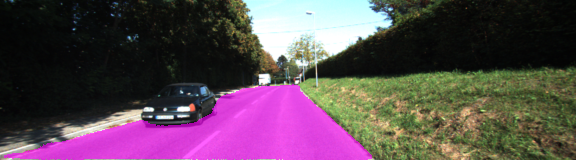
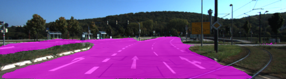

# 

# Semantic Segmentation Project

## Introduction

In this project, The model will label the pixels of a road in images using a Fully Convolutional Network (FCN) and a pre-trained VGG16 model.

### Dataset

[Kitti Road dataset](http://www.cvlibs.net/datasets/kitti/eval_road.php) which can be downloaded from [here](http://www.cvlibs.net/download.php?file=data_road.zip) 

### Architecture

The model is a Fully Convolutional Network  (You can Check this paper for more info  [Link](https://people.eecs.berkeley.edu/~jonlong/long_shelhamer_fcn.pdf)) 

which is built above a pre-trained VGG 16 model, by removing the last layer and converting it by a 1x1 convolution with 2 Classes as the depth (Road, Not Road). Then Using Upsample to restore the spatial dimensions of the input image. Some skip connections between VGG layers and the new Layers were used to improve the Performance.

### Training

The hyperparameters used for training are:

- keep_prob: 0.5
- learning_rate: 0.001
- epochs: 60
- batch_size: 5

The model was Trained using Google Colab GPU Runtime. it took about 1-2 hours of Training.

### Results

After the 60 epochs the model reached 1.4 as epoch loss. 

### Setup

##### Frameworks and Packages

helper.py and the Pre-Trained VGG model is provided by Udacity. Please check their github  Repository from [here](https://github.com/udacity/CarND-Semantic-Segmentation) 

Make sure you have the following is installed:

- [Python 3](https://www.python.org/)

- [TensorFlow](https://www.tensorflow.org/)

- [NumPy](http://www.numpy.org/)

- [SciPy](https://www.scipy.org/)

  

  ### Samples

  Below are a few sample images from the output , with the segmentation class overlaid upon the original image in violet.

